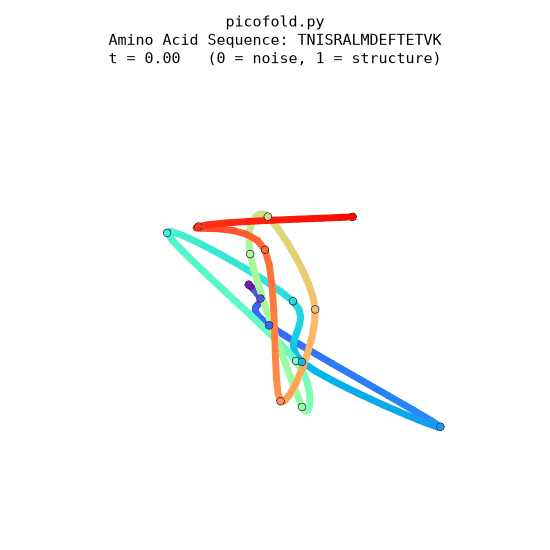
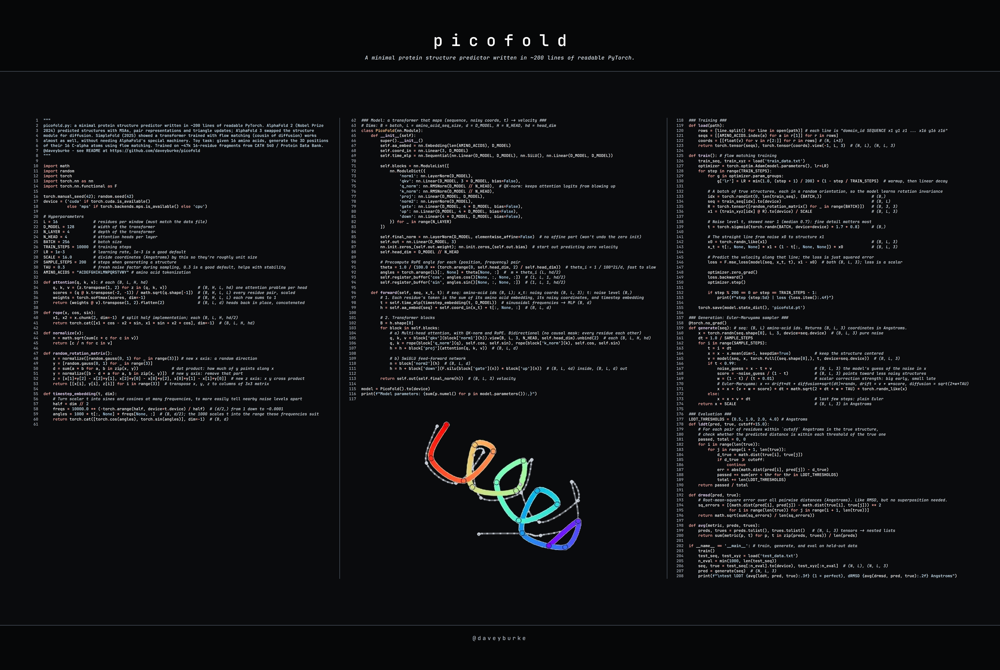

# picofold.py: 
A *minimal* protein structure predictor written in ~200 lines of *readable* PyTorch. DeepMind's [AlphaFold 2](https://www.nature.com/articles/s41586-021-03819-2) (Nobel Prize 2024) predicted structures with MSAs, pair representations and triangle updates; AlphaFold 3 swapped the structure module for diffusion. [SimpleFold (2025)](https://arxiv.org/abs/2509.18480) showed a transformer trained with flow matching (cousin of diffusion) works almost as well, without needing AlphaFold's special machinery. Toy task: given 16 amino acids, generate the 3D positions of their 16 C-alpha atoms using flow matching. Trained on ~47k 16-residue fragments from CATH S40 / Protein Data Bank. I wrote this to demystify protein folding and flow matching for me. Hope you find useful!

<p align="center">
    
</p>

## Protein 101 ##

**Proteins are strings.**
A protein is a chain of amino acids. There are 20 types, each written as a letter (`ACDEFGHIKLMNPQRSTVWY`). Each one in the chain is called a *residue* (what's left of an amino acid after it bonds into the chain). DNA encodes the sequence; a typical protein is a few hundred residues long.

**Chains fold into shapes.**
In water, the chain folds into a specific 3D shape. Oily (hydrophobic) residues bury themselves in the core, and charged or polar ones face the water. For many proteins the sequence alone determines the shape: the folded state is the lowest free-energy one.

**Shape => function.**
Enzymes, antibodies, receptors all work through their shape (think binding jigsaw pieces). Knowing a protein's structure is a big step toward knowing what it does, how mutations break it, and how to design drugs that bind to it.

**Folds are built from motifs.**
Locally, chains form recurring patterns: alpha-helices (a spiral with 3.6 residues per turn) and beta-strands (extended stretches that pair up into sheets), joined by loops. These pack together into the overall fold.

**Easy for nature, hard for humans.**
A 100-residue chain has astronomically many possible shapes, yet it folds in microseconds to seconds. Measuring a structure experimentally (X-ray crystallography, cryo-EM, NMR) can take months. The Protein Data Bank holds about 200k structures. AlphFold has since prediced 200M proteins structures.

**For ML nerds:**
Sequence in (one token per residue), 3D atom coordinates out (one point per residue). Every residue has the same backbone atoms plus a side chain that makes it one of the 20 kinds. picofold keeps one backbone atom per residue, the C-alpha, and neighboring C-alphas are always about 3.8 Å apart. It predicts 16-residue windows, which is enough for helices and strands, but not complete folds.

## SimpleFold: Flow matching with transformers

SimpleFold treats folding like text-to-image generation: start from random noise and
gradually turn it into a structure, conditioned on the amino acid sequence $s$. The
network is a standard transformer, with no MSAs, pair representations or triangle updates unlike AlphaFold.

### Training
Take a true structure $x$ and a noise sample $\epsilon \sim \mathcal{N}(0, I)$
of the same shape. In SimpleFold, $`x, \epsilon \in \mathbb{R}^{N_a \times 3}`$ cover all $`N_a`$
heavy atoms; picofold uses just the 16 C-alpha atoms. Pick a time $t \in [0, 1]$ and mix them:

$$x_t = t\thinspace x + (1-t)\thinspace\epsilon \qquad ...(2.1)$$

Eq. 2.1 just finds a spot on a straight line, where $t$ is your progress bar: pure noise
at $t=0$, the true structure at $t=1$. Differentiating gives the velocity along the line,
which is constant:

$$v_t = \frac{dx_t}{dt} = x - \epsilon$$

A transformer $`v_\theta(x_t, t \mid s)`$ sees the noisy structure, the time and the sequence,
and learns to predict that velocity with plain squared error:

$$\mathcal{L} = \mathbb{E}_{x,\thinspace s,\thinspace\epsilon,\thinspace t}\thinspace\big\Vert v_\theta(x_t, t \mid s) - (x - \epsilon) \big\Vert^2$$

That's the basic recipe: sample a random $t$ and $\epsilon$, compute $`x_t`$, train the transformer so its output matches the true velocity $x - \epsilon$ by squared error.
The output is a 3D velocity for every atom (in picofold, one per residue).

**What the model learns.** Imagine thousands of cars, each driving in a straight line
from a random starting point (noise $\epsilon$) to its destination (a structure $x$). Stand
at any intersection at time $t$ and average the velocities of the cars passing through:
that average is the vector field $`v_\theta(x, t \mid s)`$. Squared-error regression learns
exactly this average. For each sequence $s$, the model learns one vector field that
evolves with $t$, and a single network computes all of them.

### Generation
To fold a new sequence, start from random noise at $t=0$ and follow the velocity field
v bit by bit to $t=1$. The simplest way is Euler steps, `x += v * dt` but the model's $v$ is just an
average so errors would accumulate. Instead, SimpleFold uses a stochastic differentiatial equation (SDE)
version called Euler–Maruyama which introduces a random noise kick at each step:

$$x_{n+1} = x_n + a(t_n, x_n)\Delta t + b(t_n, x_n)\Delta W_n$$

where $a$ is the deterministic drift part, $b$ is the diffusion part, and $\Delta W_n = \sqrt{\Delta t}.\mathcal{N}(0, 1)$ is the Wiener process (basically Gaussian noise whose variance increases proportional to time steps). 

The model was trained to remove clean Gaussian noise, i.e. to eventually get to the clean training example as $t$ increases. But it is imperfect so we apply a trick to remove the model's estimate of noise and re-add clean Gaussian noise so errors don't accumulate when we iteratively generate the 3d structure. 
The model's guess of the noise at time t is $x - t.v$ (this comes from substituting $v = x_1 - \epsilon$ into eqn 2.1). The the drift component gets an extra term, (this pulls the prediction toward less noisy structure) and add in fresh noise to the diffusion component:
the score, that points away from the estimated noise.

$$\text{drift} \ a = v_\theta(x_t, t \mid s) + \tfrac{1}{2}\thinspace w(t)\thinspace\mathrm{score}_\theta$$
$$\qquad \text{diffusion} \ b = \sqrt{\tau\thinspace w(t)}$$

where $`\mathrm{score}_\theta = -(x_t - t\thinspace v_\theta(x_t, t \mid s))/(1-t)`$,
$w(t) = (1-t)/(t+0.01)$, and $\tau$ is the fresh noise factor added during generation. The remove/re-add pair is balanced, so it doesn't bias the result.

The $1/(1−t)$ factor is there because $x_t$ only contains $(1−t)$ * noise.

$w$ is how strongly to apply the remove-and-reintroduce correction at time $t$:
Early ($t$ ~ 0): the structure is still a blur, so aggressive correction is helpful. The generation can explore and fix bad starts.
Late ($t$ ~ 1.0): the structure is nearly final and messing with it now would only blur fine detail, so $w$ fades out.

Together these let the generation correct its own mistakes as it goes. In picofold, plain Euler reaches lDDT 0.54, barely above a random real fragment;
Euler–Maruyama reaches 0.62.

## Model code

Each residue becomes one token: the sum of what it is (amino acid), where it is (noisy
coordinates), and how noisy the structure is (timestep embedding).

```python
h = self.aa_embed(seq) + self.coord_in(x_t) + t[:, None, :]  # (B, L, d)
```

*Aside*: In NumPy/PyTorch an index like `t[:, None, :]` means each comma-separated slot refers to one axis: : keeps that axis as-is, and None inserts a brand-new axis of length 1 at that position, so it reads as "all of B, a new axis here, all of d" so $t$ goes from shape (B, d) to (B, 1, d). The addition will broadcast it, meaning each t's d-vector is added to all L residues.

The tokens then pass through 4 standard transformer blocks: bidirectional attention (no KV cache needed!) with
RoPE and QK-norm, then a SwiGLU feed-forward layer. A final linear layer maps each token to
a 3D velocity, and it starts at zero.

Training is the flow-matching recipe from above, with one addition: each structure is
spun to a random orientation, so the model learns that rotating a protein doesn't
change it.

```python
x1 = (train_xyz[idx] @ R).to(device) / SCALE                      # true structures, randomly rotated
t = torch.sigmoid(torch.randn(BATCH, device=device) * 1.7 + 0.8)  # skewed near 1, median 0.7: fine detail matters most
x0 = torch.randn_like(x1)                                         # noise
x_t = t[:, None, None] * x1 + (1 - t[:, None, None]) * x0         # Eq. 2.1
loss = F.mse_loss(model(seq, x_t, t), x1 - x0)                    # predict v = x - ϵ
```

## Generation code

Start from noise and take 200 Euler–Maruyama steps from $t=0$ to $t=1$, re-centering the
structure each step:

```python
noise_guess = x - t * v                  # the model's guess of the noise in x
score = -noise_guess / (1 - t)           # points toward less noisy structures
w = (1 - t) / (t + 0.01)                 # correction strength: big early, small late
x = x + (v + w * score) * dt + math.sqrt(2 * dt * w * TAU) * torch.randn_like(x)
```

The last few steps (t ≥ 0.99) are plain Euler, where the score's 1/(1−t) would blow up.
Coordinates are scaled by 1/16 throughout so they're roughly unit-sized like the noise,
and multiplied back to Angstroms at the end.

## Evaluation code

A generated structure comes out in an arbitrary orientation. The model never sees which
way the true structure was facing, since training rotated everything randomly. Comparing
raw coordinates would therefore penalize a perfect prediction that's simply turned
around. Instead, both metrics compare *internal distances*: for each pair of residues,
how far apart are they in the prediction, and how far apart in the true structure? The
error for that pair is the difference between those two distances. For example, if
residues 3 and 7 are 6.2 Å apart in the true structure and 7.0 Å apart in the
prediction, the error is 0.8 Å. 

Predictions are scored on 1,000 held-out fragments from proteins never seen in training:

- **lDDT** (0 to 1, higher is better): the fraction of errors under 0.5, 1, 2 and 4 Å,
  averaged over the four thresholds. Only pairs within 15 Å of each other in the true
  structure are counted, so it focuses on local geometry. It's the standard score
  used by AlphaFold.
- **dRMSD** (Å, lower is better): the root-mean-square errors, a single
  "typical error" in Angstroms.

| | lDDT ↑ | dRMSD ↓ |
|---|---|---|
| picofold | 0.62 | 3.7 Å |
| random real fragment (baseline) | 0.52 | 4.9 Å |

The baseline "predicts" a random real fragment of protein geometry that's unrelated to the
sequence, so picofold's gap over it is what it learned from the sequence. 

## Running the code ##

Setup Python environment and run!

```bash
python -m venv pico-env
source pico-env/bin/activate
pip install -r requirements.txt

python picofold.py
```

Training data was produced by `picofold_data_prep.py`, which downloads the CATH S40 set of
experimentally determined protein domains (no two sharing more than 40% sequence identity)
and cuts each chain into 16-residue windows of C-alpha coordinates, skipping gaps where
residues are missing. Train and test are split by protein rather than by window, so the
model is always tested on proteins it has never seen. This part was written exclusively by Claude.

Visualization produced by `picofold_visualizer.py`, which loads the trained model and draws
a test fragment's true structure next to four generated samples (`picofold_structure.png`),
plus an animation of one sample condensing from noise into a structure (`picofold_folding.gif`).
Run `python picofold_visualizer.py 123` to pick a different test fragment. This part was written exclusively by Claude.

## Limitations ##
picofold.py is designed to be a minimal, easy to understand implementation of protein folding on a toy training set. 
It distills the key concepts down to their essence for pedagogical reasons. Things that would improve the model:
 - Mirror images. The model sometimes builds left-handed helices, which real
   proteins never have, and both metrics are blind to it because
   mirroring preserves every distance. A mirror-sensitive input feature
   (each residue's local twist angle) or much more training would help.
 - A high floor on lDDT. Many residue pairs in a 16-residue window are easy
   (neighbors along the chain are always 3.8 A apart), so even a random real
   window scores 0.52.
 - Local only. 16-residue windows hold secondary structure (helices,
   strands, turns), not whole folds. Longer windows and protein language
   model embeddings learned from evolution such as ESM (which SimpleFold uses)
   would be the next steps toward real folding.

PS: I also wrote a version of this as microfold.py, a pure Python implementation, but at 1M+ parameters it was far too slow! The picofold.py is shorter, easier to understand, and executes much faster. Thanks to PyTorch, picofold.py runs on GPU, MPS (i.e. Mac), or CPU. 
